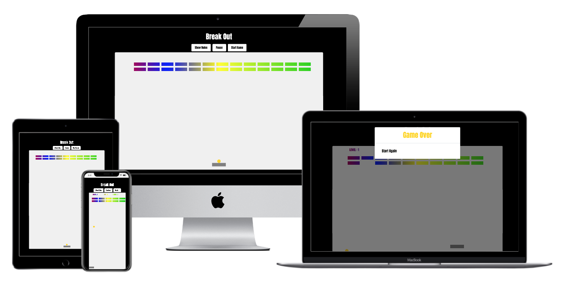
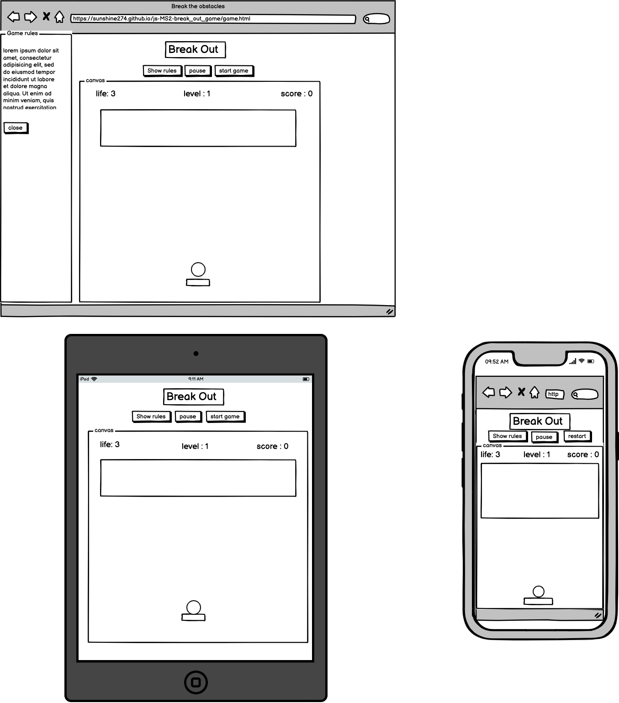

# MS2 Basic Breakout Game

View the live project [here](https://sunshine274.github.io/MS2-breakout_game/)

<h2 align="center"></h2>

#### This basic breakout game project aims to put my knowledge of HTML/CSS/JavaScript into practice and improve my skills in interactive functionalities.  This project is also a tribute to the original 1970s Breakout Game made by Steve Wozniak, which inspired certain aspects of Apple II computers.

## User Experience (UX)

-   ### User stories

    -   #### First Time Breakout Game Player Goals

        1. As a First Time Game Player, I want to easily understand how to play the breakout game.
        2. As a First Time Game Player, I want to easily manipulate the paddle to play.
        3. As a First Time Game Player, I want to be visually motivated while playing.
        4. As a First Time Game Player, I want to be able to gain scores and level up.
        5. As a First Time Game Player, I want to pause or reset the game whenever I want without losing what I have achieved.

    -   #### Experienced Breakout Game Player Goals

        1. As an Experienced Breakout Game Player, I want to play the game smoothly without unnecessary distractions.
        2. As an Experienced Breakout Game Player, I want to feel challenged and a sense of fulfillment after play.
    

-   ### Design
    -   #### Colour Scheme
        -   With reference to the classic breakout game in 1970s, this game has a white canvas on black background for stronger visual impact, and elements/texts are filled with rainbow colours.
    -   #### Typography
        -   The Anton font is the main font used throughout the whole website with cursive as the fallback font in case for any reason the font isn't being imported into the site correctly. Anton is a bold font with excellent visual result for game background, and it is easy to read.
    -   #### Sound
        -   Sound effects are essential to motivate the player, although in this project the sound clips were made by myself from free resources.

*   ### Wireframes

    <h2 align="center"></h2>   

## Features

-   Responsive on all device sizes
-   Sound effects
-   Interactive buttons and paddle

## Technologies Used

### Languages Used

-   [HTML5](https://en.wikipedia.org/wiki/HTML5)
-   [CSS3](https://en.wikipedia.org/wiki/Cascading_Style_Sheets)
-   [JavaScript](https://www.javascript.com/)

### Frameworks, Libraries & Programs Used

1. [Bootstrap 4.5.3:](https://www.jsdelivr.com/package/npm/bootstrap)
    - Bootstrap was used to assist with the responsiveness and styling of the website.
1. [Google Fonts:](https://fonts.google.com/)
    - Google fonts were used to import the 'Anton' font into the style.css file which is used on all pages throughout the project.
1. [jQuery:](https://jquery.com/)
    - jQuery came with Bootstrap to make the navbar responsive but was also used for the smooth scroll function in JavaScript.
1. [Git](https://git-scm.com/)
    - Git was used for version control by utilizing the Gitpod terminal to commit to Git and Push to GitHub.
1. [GitHub:](https://github.com/)
    - GitHub is used to store the projects code after being pushed from Git.
1. [Balsamiq:](https://balsamiq.com/)
    - Balsamiq was used to create the wireframes during the design process.

## Testing

The W3C Markup Validator and W3C CSS Validator Services were used to validate every page of the project to ensure there were no syntax errors in the project.

-   [W3C Markup Validator](https://jigsaw.w3.org/css-validator/#validate_by_input) 
-   [W3C CSS Validator](https://jigsaw.w3.org/css-validator/#validate_by_input) 
-   [JS Validator](https://jshint.com/)

### Testing User Stories from User Experience (UX) Section

 #### First Time Breakout Game Player Goals

1. As a First Time Game Player, I want to easily understand how to play the breakout game.
    1. The "Show Rules" button will open the short explaination of "How to Play".
2. As a First Time Game Player, I want to easily manipulate the paddle to play.
    1. Once the player clicked the "start game" button, the paddle will immediately start to move with the movement of mouse.
3. As a First Time Game Player, I want to be visually motivated while playing.
    1. The background colour and canvas colour are in black and white contradiction, and the bricks are designed in rainbow colours.
4. As a First Time Game Player, I want to be able to gain scores and level up.
    1. The player will score with every brick being hit, and the game will level up once the player breaks all the bricks on canvas.
5. As a First Time Game Player, I want to pause or reset the game whenever I want without losing what I have achieved.
    1. The pause/continue button provides the player freedom to pause the game.

#### Experienced Breakout Game Player Goals

1. As an Experienced Breakout Game Player, I want to play the game smoothly without unnecessary distractions.
    1. This is a single page breakout game with minimal functions, and the classic design helps the player to focus on the control of paddle to score.
2. As an Experienced Breakout Game Player, I want to feel challenged and a sense of fulfillment after play.
    1. There are three levels and the ball has three lives which motivate the player to accumulate score to level up without losing life.


### Further Testing

-   The Website was tested on Google Chrome, FireFox, Microsoft Edge and Safari browsers.
-   The website was viewed on a variety of devices such as Desktop, Laptop, iPhone7, iPhone 8.
-   Friends and family members were asked to play the game to point out any bugs and/or user experience issues.

### Known Bugs

-   On mobile devices with small screens, the play experience might be very limited, while on devices with large screen such as iMac, the user experience is better when the browser window is minished.
-   The bricks might not be 100% centered in some browser windows.
-   The ball sometimes pierces through bricks instead of breaking them.
-   The ball speed is escalated after first bounce to the paddle at level 1. (Given more time I should be able to fix this).
-   There is still an error code according to Google inspect, "Manifest: Line: 1, column: 1, Syntax error.", which I have not yet been able to resolve.

## Deployment

### GitHub Pages

- The project was deployed to GitHub Pages at https://sunshine274.github.io/MS2-breakout_game/

- The project was deployed to GitHub Pages using the following steps:

1. Log in to GitHub and locate the [GitHub Repository](https://github.com/sunshine274/MS2-breakout_game)
2. At the top of the Repository (not top of page), locate the "Settings" Button on the menu.
3. Scroll down the Settings page until you locate the "GitHub Pages" Section.
4. Under "Source", click the dropdown called "None" and select "Master Branch".
5. The page will automatically refresh.
6. Scroll back down through the page to locate the now published site [link](https://sunshine274.github.io/MS2-breakout_game/) in the "GitHub Pages" section.

### Forking the GitHub Repository

By forking the GitHub Repository we make a copy of the original repository on our GitHub account to view and/or make changes without affecting the original repository by using the following steps...

1. Log in to GitHub and locate the [GitHub Repository](https://github.com/sunshine274/MS2-breakout_game)
2. At the top of the Repository (not top of page) just above the "Settings" Button on the menu, locate the "Fork" Button.
3. You should now have a copy of the original repository in your GitHub account.

### Making a Local Clone

1. Log in to GitHub and locate the [GitHub Repository](https://github.com/sunshine274/MS2-breakout_game)
2. Under the repository name, click "Clone or download".
3. To clone the repository using HTTPS, under "Clone with HTTPS", copy the link.
4. Open Git Bash
5. Change the current working directory to the location where you want the cloned directory to be made.
6. Type `git clone`, and then paste the URL you copied in Step 3.

```
$ git clone https://github.com/sunshine274/js-MS2-break_out_game
```

7. Press Enter. Your local clone will be created.

```
$ git clone https://github.com/sunshine274/js-MS2-break_out_game
> Cloning into `CI-Clone`...
> remote: Counting objects: 10, done.
> remote: Compressing objects: 100% (8/8), done.
> remove: Total 10 (delta 1), reused 10 (delta 1)
> Unpacking objects: 100% (10/10), done.
```

## Credits

### Code

-   The basic game elements and functions inspired by tutorials on YouTube from [Brad Traversey](https://www.youtube.com/watch?v=gm1QtePAYTM) and [Code Explained](https://www.youtube.com/watch?v=FyZ4_T0GZ1U&t=237s), and [MDN Web Docs](https://developer.mozilla.org/en-US/docs/Games/Tutorials/2D_Breakout_game_pure_JavaScript);

-   [Bootstrap4](https://getbootstrap.com/docs/4.4/getting-started/introduction/): Bootstrap Library used throughout the project mainly to make site responsive using the Bootstrap Grid System.

### Content

-   All content was written by the developer except the Deployment section of README.md was based on the CI template.

### Media

-   The sound clips were made by myself from the sound file of Ping-Pong-Sound-Effect authorised by Free Sounds Library at https://www.freesoundslibrary.com/ping-pong-sound-effect/

### Acknowledgements

-   My Mentor for continuous helpful feedback.

-   Tutor support at Code Institute for their support.
